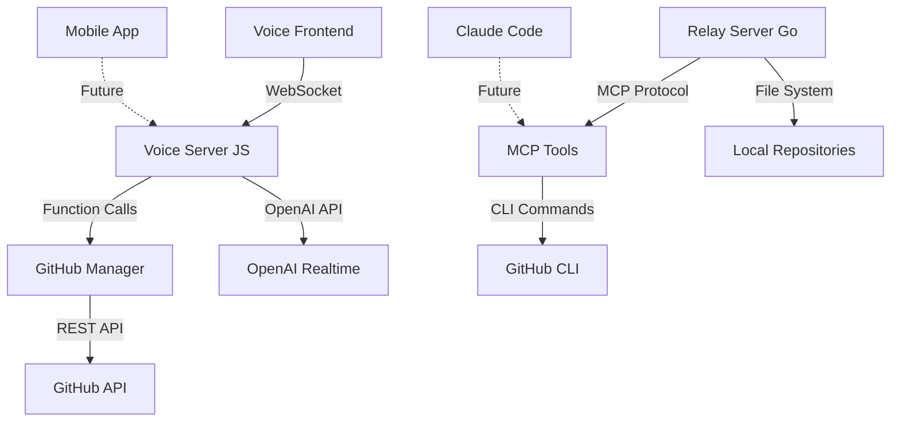
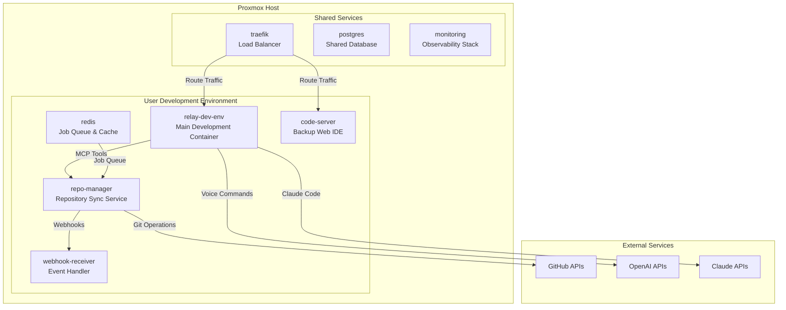
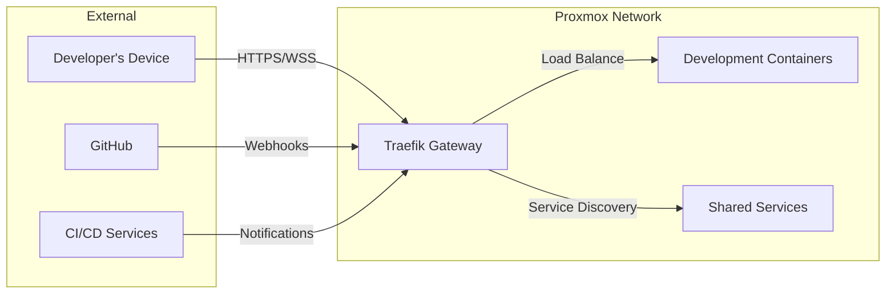
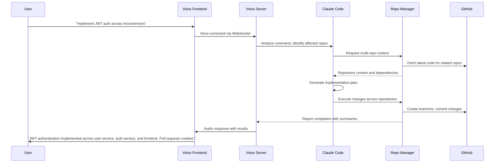
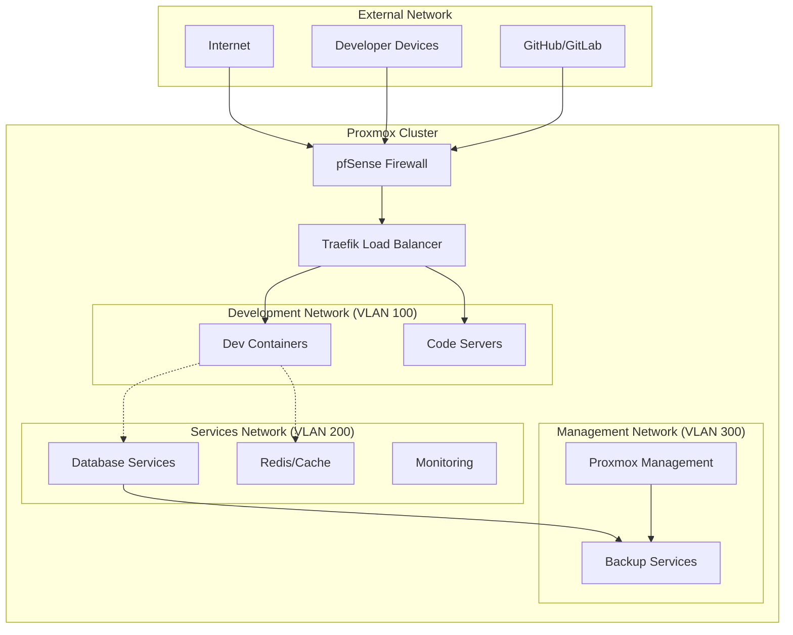

# Relay Architecture Plan: Conversational Agentic Coding with Proxmox Infrastructure

**Version:** 1.0  
**Date:** December 2024  
**Status:** Planning Phase

---

## Executive Summary

### Vision: The Future of Voice-Controlled Development

Relay represents the next evolution in software development workflows—a conversational agentic coding platform where developers interact with their entire codebase ecosystem through natural voice commands. By integrating Claude Code with Proxmox-hosted container infrastructure, Relay transforms from a single-project tool into a comprehensive multi-repository development orchestrator.

**The Promise:**
- **Natural Conversations**: "Analyze the authentication flow across my microservices and suggest optimizations"
- **Autonomous Execution**: AI agents that can implement features, run tests, and manage deployments
- **Cross-Project Intelligence**: Understanding relationships between repositories and services
- **Voice-First Workflow**: Hands-free development enabling mobile-first coding experiences

### Strategic Advantages

1. **Development Velocity**: 3-5x faster feature development through AI-assisted coding
2. **Context Preservation**: Maintain project context across complex multi-repository architectures
3. **Mobile Development**: Code effectively from mobile devices using voice commands
4. **Team Collaboration**: Shared development environments with voice-controlled pair programming
5. **Reduced Cognitive Load**: AI handles routine tasks while developers focus on architecture and design

### Key Differentiators

- **Voice-Native Interface**: Built from the ground up for voice interaction, not retrofitted
- **Multi-Repository Awareness**: Understand dependencies and relationships across codebases
- **Proactive AI Assistance**: Suggests improvements, identifies issues, and proposes solutions
- **Infrastructure-Integrated**: Deep integration with containerized development environments

---

## Current State Analysis

### Existing Components Assessment

#### 1. **Relay Server (Go)** - `server/`
**Current Capabilities:**
- Project management and Git operations
- GitHub integration and issue tracking
- MCP tool integration framework
- Local database and configuration management
- TUI and REPL interfaces

**Strengths:**
- Robust project switching and management
- Extensible tool architecture via MCP
- Strong Git and GitHub integration
- Performance-optimized Go implementation

**Integration Opportunities:**
- Extend MCP framework for Claude Code integration
- Enhance multi-repository coordination
- Add webhook handling for real-time updates

#### 2. **Voice Server JS** - `voice-server-js/`
**Current Capabilities:**
- OpenAI Agent SDK integration
- WebSocket-based real-time communication
- Voice command processing and function calling
- GitHub operations via voice commands
- Real-time transcription and audio feedback

**Strengths:**
- Modern OpenAI Realtime API integration
- Sophisticated function calling with automatic schema generation
- Real-time bidirectional communication
- Docker containerization support

**Enhancement Areas:**
- Cross-repository context management
- Claude Code tool integration
- Enhanced error handling and recovery
- Multi-session management

#### 3. **Voice Frontend (React)** - `voice-frontend/`
**Current Capabilities:**
- Modern React/TypeScript interface
- Real-time voice recording and playback
- GitHub repository selection and management
- Function result visualization
- Developer mode for direct tool testing

**Strengths:**
- Responsive design for mobile and desktop
- Real-time WebSocket integration
- Clean, GitHub-inspired UI
- Comprehensive state management

**Growth Potential:**
- Multi-repository dashboard
- Visual code diff and review interfaces
- Collaborative features and shared sessions
- Advanced visualization for complex operations

#### 4. **MCP Tools** - `mcp/`
**Current Capabilities:**
- Issue planner with GitHub integration
- Shared utilities for MCP tool development
- JSON-RPC protocol implementation
- Auto-detection of Git branch and issue numbers

**Expansion Opportunities:**
- Claude Code MCP tool wrapper
- Repository synchronization tools
- Cross-project analysis tools
- Automated testing and deployment tools

### Current Data Flow



### Current Strengths to Preserve

1. **Voice-First Design**: All components built with voice interaction as primary interface
2. **Real-Time Communication**: WebSocket-based architecture enables responsive interactions
3. **Modular Architecture**: Clean separation allows independent component evolution
4. **GitHub Integration**: Deep integration with GitHub ecosystem and workflows
5. **Container Support**: Existing Docker configurations ease deployment

### Gaps to Address

1. **Multi-Repository Coordination**: Limited cross-project awareness and management
2. **Claude Code Integration**: No direct integration with Claude Code capabilities
3. **Persistent Context**: Limited memory across sessions and complex operations
4. **Scalability**: Current architecture optimized for single-user, single-project workflows
5. **Advanced AI Capabilities**: Limited to function calling rather than autonomous development

---

## Target Architecture

### Infrastructure Overview: Proxmox-Hosted Container Ecosystem

The new Relay architecture leverages Proxmox's virtualization capabilities to create a scalable, multi-tenant development environment. This approach enables:

- **Resource Isolation**: Each user or project gets dedicated containers
- **Scalability**: Dynamic resource allocation based on demand
- **Persistence**: Reliable storage and backup of development environments
- **Security**: Network-level isolation and access controls

### Container Stack Architecture



### Core Components Specification

#### 1. **relay-dev-env** - Main Development Container

**Purpose**: Primary development environment with Claude Code integration

**Technical Specifications:**
- **Base Image**: Ubuntu 22.04 LTS with development tools
- **CPU**: 2-4 vCPUs (burstable to 8)
- **Memory**: 4-8GB RAM (expandable to 16GB)
- **Storage**: 50GB persistent volume + 20GB temp
- **Network**: Bridge network with external access

**Installed Components:**
- Claude Code CLI with full configuration
- Node.js 20+ LTS with npm/yarn
- Go 1.21+ for MCP tool development
- Git with GitHub CLI authentication
- Docker client for container management
- Python 3.11+ for data analysis tools

**Relay Integration:**
- Enhanced Relay Server (Go) with Claude Code MCP tools
- Voice Server JS with expanded command set
- Repository management client for multi-repo operations
- Real-time synchronization with external repositories

**Example Docker Configuration:**
```dockerfile
FROM ubuntu:22.04

# Install base development tools
RUN apt-get update && apt-get install -y \
    curl git build-essential \
    nodejs npm python3 python3-pip \
    && curl -fsSL https://go.dev/dl/go1.21.5.linux-amd64.tar.gz | tar -xzC /usr/local

# Install Claude Code
RUN npm install -g @anthropic/claude-code

# Install Relay components
COPY relay-server /usr/local/bin/relay
COPY voice-server-js /app/voice-server

# Configure development environment
WORKDIR /workspace
VOLUME ["/workspace", "/home/relay/.config"]

CMD ["relay", "start", "--voice-enabled", "--multi-repo"]
```

#### 2. **repo-manager** - Repository Synchronization Service

**Purpose**: Automated multi-repository management and synchronization

**Core Responsibilities:**
- Monitor multiple Git repositories for changes
- Synchronize repositories based on dependency graphs
- Handle webhook events from GitHub/GitLab
- Manage branch strategies across related projects
- Queue and execute repository operations

**Technical Implementation:**
```yaml
# docker-compose.yml excerpt
services:
  repo-manager:
    build: ./repo-manager
    environment:
      - GH_TOKEN=${GH_TOKEN}
      - REDIS_URL=redis://redis:6379
      - WEBHOOK_SECRET=${WEBHOOK_SECRET}
    volumes:
      - repositories:/repos
      - ./config/repo-config.yaml:/config.yaml
    ports:
      - "9090:9090"  # Webhook endpoint
    depends_on:
      - redis
```

**Configuration Example:**
```yaml
# repo-config.yaml
repositories:
  - name: "frontend"
    url: "git@github.com:user/frontend.git"
    dependencies: ["shared-api"]
    sync_strategy: "feature_branch"
    auto_sync: true
    
  - name: "backend"
    url: "git@github.com:user/backend.git" 
    dependencies: ["shared-api", "database-migrations"]
    sync_strategy: "main_branch"
    auto_sync: true

dependency_graph:
  shared-api: []
  database-migrations: ["shared-api"]
  backend: ["shared-api", "database-migrations"]
  frontend: ["shared-api"]

sync_rules:
  - trigger: "shared-api:main"
    action: "update_dependents"
    notify: ["backend", "frontend"]
```

#### 3. **redis** - Job Queue and Caching

**Purpose**: Reliable job queuing and caching for repository operations

**Use Cases:**
- Queue repository sync operations
- Cache repository metadata and status
- Store voice session context
- Manage long-running operations (builds, tests, deployments)

**Configuration:**
```yaml
redis:
  image: redis:7-alpine
  volumes:
    - redis_data:/data
  ports:
    - "6379:6379"
  command: redis-server --appendonly yes --maxmemory 512mb
```

#### 4. **code-server** - Backup Web IDE

**Purpose**: Fallback web-based development interface

**Features:**
- Full VS Code interface in the browser
- Access to the same file system as relay-dev-env
- Integrated terminal with Relay CLI access
- Extensions for voice development workflow

#### 5. **webhook-receiver** - Event Handler

**Purpose**: Real-time webhook processing for external events

**Supported Events:**
- GitHub push/pull request events
- Issue creation and updates
- Release and deployment notifications
- Third-party service integrations

### Network Architecture



**Network Security:**
- TLS termination at Traefik gateway
- Internal container communication via encrypted overlay network
- VPN access for remote development
- Firewall rules restricting external access to necessary ports only

### Data Flow: Voice Command to Code Execution



---

## Voice Interface Design

### Natural Language Command Patterns

#### Multi-Repository Commands

**Cross-Project Analysis:**
- *"Analyze the data flow from the frontend login to the auth service"*
- *"Show me all the places where user authentication is implemented"*
- *"Find inconsistencies in error handling across our microservices"*

**Coordinated Development:**
- *"Create a new feature for user preferences that works across all services"*
- *"Update the API version in all dependent services"*
- *"Implement rate limiting consistently across backend services"*

**Testing and Deployment:**
- *"Run integration tests for the payment flow"*
- *"Deploy the staging environment with the latest changes"*
- *"Check if all services are compatible with the new database schema"*

#### Advanced AI-Assisted Commands

**Code Generation:**
- *"Generate a React component for user profile management with proper TypeScript types"*
- *"Create database migrations for the new user preferences table"*
- *"Write comprehensive tests for the authentication middleware"*

**Refactoring and Optimization:**
- *"Refactor the user service to use dependency injection"*
- *"Optimize the database queries in the product service"*
- *"Extract common utilities into a shared library"*

**Architecture and Design:**
- *"Design a caching strategy for the product catalog"*
- *"Propose a solution for handling real-time notifications"*
- *"Review the security implications of the current authentication flow"*

### Context Management Strategy

#### Session Context

**Conversation Memory:**
```typescript
interface VoiceSession {
  sessionId: string;
  userId: string;
  startTime: Date;
  activeRepositories: string[];
  conversationHistory: ConversationTurn[];
  currentContext: ProjectContext;
}

interface ProjectContext {
  primaryRepository: string;
  relatedRepositories: string[];
  currentBranch: string;
  recentChanges: FileChange[];
  openIssues: Issue[];
  buildStatus: BuildStatus;
}
```

**Context Persistence:**
- Store conversation context in Redis with TTL
- Maintain project state across voice sessions
- Sync context when switching between repositories
- Preserve context during container restarts

#### Multi-Repository Context

**Dependency Awareness:**
```yaml
# Example context for microservices architecture
context:
  primary_repo: "user-service"
  related_repos:
    - "auth-service"
    - "notification-service" 
    - "frontend"
  shared_dependencies:
    - "common-types"
    - "database-schemas"
  current_operation: "implement_jwt_refresh"
  affected_files:
    - "user-service/src/auth/middleware.ts"
    - "auth-service/src/tokens/refresh.ts"
    - "frontend/src/auth/hooks.ts"
```

**Smart Context Switching:**
- Automatically include related repositories in command scope
- Detect when commands require cross-repository coordination
- Maintain context of ongoing multi-repo operations
- Provide summaries when switching between projects

### Error Handling and User Feedback

#### Voice Feedback Strategies

**Progressive Feedback:**
1. **Immediate Acknowledgment** (< 200ms): "I'm analyzing your request..."
2. **Progress Updates** (every 5-10s): "Checking dependencies in auth-service..."
3. **Completion Summary** (< 30s): "JWT refresh implemented. 3 files modified, 2 PRs created."

**Error Communication:**
- Clear, non-technical language for errors
- Suggested next steps or alternatives
- Option to retry with modifications
- Escalation to text interface for complex errors

**Example Error Flow:**
```
User: "Deploy to production"
System: "I need to run tests first. The user-service tests are failing. Would you like me to:"
1. "Show you the failing tests"
2. "Try to fix the test failures"
3. "Deploy anyway with --force flag"
4. "Switch to a different branch"
```

### Integration with Existing Tools

#### Enhanced Voice Server JS

**New Command Categories:**
```javascript
// Enhanced tool definitions
export const claudeCodeTools = {
  analyzeCodebase: {
    name: 'analyze_codebase',
    description: 'Analyze code across multiple repositories',
    parameters: {
      scope: ['single_repo', 'related_repos', 'all_repos'],
      analysis_type: ['security', 'performance', 'architecture', 'dependencies']
    }
  },
  
  implementFeature: {
    name: 'implement_feature',
    description: 'Implement a feature across multiple repositories',
    parameters: {
      feature_description: 'string',
      affected_repos: 'array',
      implementation_strategy: ['minimal', 'comprehensive', 'phased']
    }
  }
};
```

**Claude Code Integration:**
```javascript
class ClaudeCodeManager {
  async executeWithContext(command, context) {
    // Prepare multi-repository context for Claude Code
    const repoContext = await this.gatherRepositoryContext(context.repositories);
    
    // Execute Claude Code with full context
    const result = await this.claudeCode.execute(command, {
      repositories: repoContext,
      currentProject: context.primaryRepository,
      dependencies: context.dependencies
    });
    
    // Process results and update repository manager
    return await this.processResults(result);
  }
}
```

---

## Implementation Phases

### Phase 1: Foundation and Integration (Months 1-2)
**Goal**: Basic Claude Code integration with single repository workflow

#### Deliverables:
1. **Enhanced Relay Server**
   - Claude Code MCP tool integration
   - Basic voice command routing to Claude Code
   - Improved error handling and logging

2. **Container Infrastructure Setup**
   - Proxmox VM configuration and networking
   - Docker Compose environment for development containers
   - Basic monitoring and logging infrastructure

3. **Voice Server Enhancements**
   - Extended command vocabulary for Claude Code operations
   - Improved context management for longer conversations
   - Better error handling and user feedback

#### Success Metrics:
- Voice commands successfully execute Claude Code operations
- Container environment stable and performant
- 90% of existing voice commands continue to work
- Sub-3-second response time for simple commands

#### Risk Mitigation:
- Maintain backward compatibility with existing Relay functionality
- Implement feature flags for gradual rollout
- Comprehensive testing environment for new integrations

### Phase 2: Multi-Repository Management (Months 3-4)
**Goal**: Cross-repository awareness and coordinated operations

#### Deliverables:
1. **Repository Manager Service**
   - Automated repository synchronization
   - Dependency graph management
   - Webhook-driven updates

2. **Enhanced Context Management**
   - Multi-repository conversation context
   - Dependency-aware command execution
   - Cross-project impact analysis

3. **Advanced Voice Commands**
   - Multi-repository queries and operations
   - Coordinated feature development across services
   - Integration testing and deployment commands

#### Success Metrics:
- Successfully manage 5+ related repositories simultaneously
- Automatic dependency detection and coordination
- Cross-repository operations complete in under 60 seconds
- Zero data loss during repository synchronization

#### Technical Challenges:
- **Dependency Resolution**: Complex repository interdependencies
- **Conflict Management**: Handling conflicting changes across repos
- **Performance**: Maintaining responsiveness with multiple repositories

### Phase 3: Advanced Agentic Capabilities (Months 5-6)
**Goal**: Autonomous development features and intelligent assistance

#### Deliverables:
1. **Autonomous Development Agent**
   - Self-directed feature implementation
   - Intelligent testing and validation
   - Automatic code review and optimization suggestions

2. **Predictive Assistance**
   - Proactive issue detection and resolution
   - Architecture and performance recommendations
   - Security vulnerability analysis and fixes

3. **Advanced Workflow Automation**
   - Automated CI/CD pipeline management
   - Intelligent branch and merge strategies
   - Automated documentation generation

#### Success Metrics:
- 80% of routine development tasks automated
- Proactive identification of issues before they become problems
- 50% reduction in manual code review time
- Automated feature implementation accuracy >85%

#### Innovation Areas:
- **Machine Learning Integration**: Learn from developer patterns and preferences
- **Predictive Analytics**: Anticipate development bottlenecks and issues
- **Intelligent Code Generation**: Context-aware code that follows project patterns

### Phase 4: Team Collaboration and Scaling (Months 7-8)
**Goal**: Multi-user environments and team development workflows

#### Deliverables:
1. **Multi-User Support**
   - Isolated development environments per user
   - Shared project workspaces
   - Role-based access controls

2. **Collaborative Features**
   - Voice-controlled pair programming
   - Shared voice sessions and context
   - Team communication integration

3. **Enterprise Features**
   - SSO integration and authentication
   - Audit logging and compliance
   - Resource quota management and billing

#### Success Metrics:
- Support 10+ concurrent users per Proxmox host
- 99.9% uptime for shared development services
- Sub-5-second response time under full load
- Complete audit trail for all development operations

#### Scaling Considerations:
- **Resource Management**: Dynamic allocation based on demand
- **Data Isolation**: Secure separation of team workspaces
- **Performance Optimization**: Efficient resource utilization

---

## Technical Specifications

### Proxmox Deployment Recommendations

#### Hardware Requirements

**Minimum Configuration:**
- **CPU**: 16 cores (Intel Xeon or AMD EPYC)
- **RAM**: 64GB DDR4-3200
- **Storage**: 1TB NVMe SSD + 4TB HDD for backups
- **Network**: 1Gbps uplink with 10Gbps internal

**Recommended Configuration:**
- **CPU**: 32 cores with hyper-threading
- **RAM**: 128GB DDR4-3200 or DDR5
- **Storage**: 2TB NVMe SSD + 8TB HDD for backups
- **Network**: 10Gbps uplink with 25Gbps internal

**Enterprise Configuration:**
- **CPU**: 64 cores across multiple sockets
- **RAM**: 256GB+ with ECC
- **Storage**: 4TB NVMe SSD + 16TB redundant storage
- **Network**: 25Gbps+ with redundancy

#### LXC vs VM Considerations

**LXC Containers (Recommended for most workloads):**
- **Pros**: Lower overhead, faster startup, better resource efficiency
- **Cons**: Limited OS flexibility, shared kernel
- **Use Cases**: Development environments, microservices, CI/CD agents

**Virtual Machines (For specific needs):**
- **Pros**: Full OS isolation, support for any OS, better security isolation
- **Cons**: Higher resource overhead, slower startup
- **Use Cases**: Windows development, kernel development, security-sensitive workloads

#### Network Topology



**Network Configuration:**
- **Development VLAN (100)**: User containers and development services
- **Services VLAN (200)**: Shared databases, caching, and backend services
- **Management VLAN (300)**: Proxmox management and backup infrastructure
- **Firewall Rules**: Strict ingress controls, monitored egress for security

#### Container Resource Allocation

**Development Container Profile:**
```yaml
# Standard development environment
resources:
  cpu: 
    cores: 2
    limit: 4  # Burstable
  memory:
    guaranteed: 2GB
    limit: 6GB
  storage:
    root: 20GB
    workspace: 50GB
    cache: 10GB
  network:
    bandwidth: 1Gbps
    connections: 1000
```

**Team Lead Container Profile:**
```yaml
# Enhanced environment for complex operations
resources:
  cpu:
    cores: 4
    limit: 8
  memory:
    guaranteed: 8GB
    limit: 16GB
  storage:
    root: 40GB
    workspace: 200GB
    cache: 20GB
  network:
    bandwidth: 10Gbps
    connections: 5000
```

### Docker Container Specifications

#### relay-dev-env Dockerfile
```dockerfile
FROM ubuntu:22.04

# Set environment variables
ENV DEBIAN_FRONTEND=noninteractive
ENV NODE_VERSION=20
ENV GO_VERSION=1.21.5
ENV CLAUDE_CODE_VERSION=latest

# Install system dependencies
RUN apt-get update && apt-get install -y \
    curl wget git build-essential \
    python3 python3-pip \
    docker.io docker-compose \
    redis-tools postgresql-client \
    vim nano tmux htop \
    && rm -rf /var/lib/apt/lists/*

# Install Node.js
RUN curl -fsSL https://deb.nodesource.com/setup_${NODE_VERSION}.x | bash - \
    && apt-get install -y nodejs

# Install Go
RUN wget https://go.dev/dl/go${GO_VERSION}.linux-amd64.tar.gz \
    && tar -C /usr/local -xzf go${GO_VERSION}.linux-amd64.tar.gz \
    && rm go${GO_VERSION}.linux-amd64.tar.gz

# Install Claude Code
RUN npm install -g @anthropic/claude-code

# Install GitHub CLI
RUN curl -fsSL https://cli.github.com/packages/githubcli-archive-keyring.gpg | \
    gpg --dearmor -o /usr/share/keyrings/githubcli-archive-keyring.gpg \
    && echo "deb [arch=$(dpkg --print-architecture) signed-by=/usr/share/keyrings/githubcli-archive-keyring.gpg] https://cli.github.com/packages stable main" | \
    tee /etc/apt/sources.list.d/github-cli.list > /dev/null \
    && apt-get update && apt-get install -y gh

# Set up development user
RUN useradd -m -s /bin/bash relay \
    && usermod -aG docker relay \
    && echo 'relay ALL=(ALL) NOPASSWD:ALL' >> /etc/sudoers

# Install Relay components
COPY --chown=relay:relay relay-server /usr/local/bin/relay
COPY --chown=relay:relay voice-server-js /home/relay/voice-server
COPY --chown=relay:relay mcp /home/relay/mcp

# Set up workspace
WORKDIR /workspace
RUN chown relay:relay /workspace

# Configure environment
USER relay
ENV PATH="/usr/local/go/bin:/home/relay/.local/bin:${PATH}"
ENV GOPATH="/home/relay/go"

# Initialize development environment
RUN mkdir -p /home/relay/.config/relay \
    && mkdir -p /home/relay/go/{bin,src,pkg} \
    && npm install -g yarn pnpm

# Install development tools
RUN go install github.com/air-verse/air@latest \
    && npm install -g typescript ts-node nodemon

# Configure git (will be overridden by user config)
RUN git config --global init.defaultBranch main \
    && git config --global pull.rebase false

# Set up entrypoint
COPY --chown=relay:relay scripts/entrypoint.sh /home/relay/
RUN chmod +x /home/relay/entrypoint.sh

EXPOSE 8080 3000 5173
VOLUME ["/workspace", "/home/relay/.config"]

ENTRYPOINT ["/home/relay/entrypoint.sh"]
CMD ["relay", "start", "--voice-enabled"]
```

#### repo-manager Service
```dockerfile
FROM golang:1.21-alpine AS builder

WORKDIR /app
COPY go.mod go.sum ./
RUN go mod download

COPY . .
RUN CGO_ENABLED=0 GOOS=linux go build -o repo-manager .

FROM alpine:latest
RUN apk --no-cache add ca-certificates git openssh-client
WORKDIR /root/

COPY --from=builder /app/repo-manager .
COPY config/repo-config.yaml ./config.yaml

EXPOSE 9090
CMD ["./repo-manager"]
```

### Security and Access Control

#### Authentication Strategy

**Multi-Layer Authentication:**
1. **VPN Access**: WireGuard VPN for network-level security
2. **Container Authentication**: JWT tokens for container access
3. **Service Authentication**: API keys for internal service communication
4. **Git Authentication**: SSH keys and GitHub tokens for repository access

#### Access Control Model

```yaml
# RBAC Configuration
roles:
  developer:
    permissions:
      - container:access
      - repository:read,write
      - voice:command
      - tools:basic
    resources:
      cpu_limit: 4
      memory_limit: 8GB
      
  team_lead:
    permissions:
      - container:access,manage
      - repository:read,write,admin
      - voice:command,configure
      - tools:advanced
    resources:
      cpu_limit: 8
      memory_limit: 16GB
      
  admin:
    permissions:
      - "*"
    resources:
      cpu_limit: unlimited
      memory_limit: unlimited
```

#### Data Protection

**Encryption:**
- TLS 1.3 for all external communications
- AES-256 encryption for data at rest
- SSH key-based authentication for Git operations
- Encrypted container storage volumes

**Backup Strategy:**
- **Daily**: Incremental container snapshots
- **Weekly**: Full container and data backups
- **Monthly**: Offsite backup to cloud storage
- **Retention**: 30 days local, 1 year offsite

**Audit Logging:**
- All voice commands and responses logged
- File system changes tracked with git
- API calls logged with full context
- Container access and resource usage monitored

### Monitoring and Observability

#### Metrics Collection

**Infrastructure Metrics:**
- Proxmox host performance (CPU, memory, storage, network)
- Container resource utilization and limits
- Network traffic and latency between services
- Storage performance and capacity usage

**Application Metrics:**
- Voice command processing time and success rate
- Claude Code operation duration and accuracy
- Repository synchronization status and conflicts
- User session duration and activity patterns

#### Monitoring Stack

```yaml
# Prometheus configuration
prometheus:
  image: prom/prometheus:latest
  ports:
    - "9090:9090"
  volumes:
    - ./prometheus.yml:/etc/prometheus/prometheus.yml
    - prometheus_data:/prometheus

grafana:
  image: grafana/grafana:latest
  ports:
    - "3000:3000"
  environment:
    - GF_SECURITY_ADMIN_PASSWORD=secure_password
  volumes:
    - grafana_data:/var/lib/grafana

loki:
  image: grafana/loki:latest
  ports:
    - "3100:3100"
  volumes:
    - loki_data:/loki

promtail:
  image: grafana/promtail:latest
  volumes:
    - /var/log:/var/log:ro
    - ./promtail.yml:/etc/promtail/promtail.yml
```

#### Alerting Rules

**Critical Alerts:**
- Container failure or restart
- High resource utilization (>90% for 5 minutes)
- Voice command failure rate >10%
- Repository synchronization failures

**Warning Alerts:**
- Resource utilization >75% for 15 minutes
- Slow voice command response time (>5 seconds)
- High error rate in logs (>5% error rate)
- Backup failures

---

## Integration with Existing Tools

### MCP Tool Ecosystem Enhancement

#### Claude Code MCP Tool

**Implementation Strategy:**
```go
// Claude Code MCP Tool Implementation
package main

type ClaudeCodeTool struct {
    client *claudecode.Client
    config *ClaudeCodeConfig
}

type ClaudeCodeConfig struct {
    APIKey        string            `json:"api_key"`
    Model         string            `json:"model"`
    MaxTokens     int              `json:"max_tokens"`
    RepositoryMap map[string]string `json:"repository_map"`
}

func (cc *ClaudeCodeTool) Execute(request MCPRequest) MCPResponse {
    switch request.Method {
    case "analyze_code":
        return cc.analyzeCode(request.Params)
    case "implement_feature":
        return cc.implementFeature(request.Params)
    case "refactor_code":
        return cc.refactorCode(request.Params)
    case "generate_tests":
        return cc.generateTests(request.Params)
    default:
        return MCPResponse{Error: "Unknown method"}
    }
}

func (cc *ClaudeCodeTool) analyzeCode(params map[string]interface{}) MCPResponse {
    // Extract repositories and analysis type from params
    repositories := params["repositories"].([]string)
    analysisType := params["analysis_type"].(string)
    
    // Gather code context from multiple repositories
    context := cc.gatherMultiRepoContext(repositories)
    
    // Execute Claude Code analysis
    result, err := cc.client.Analyze(context, analysisType)
    if err != nil {
        return MCPResponse{Error: err.Error()}
    }
    
    return MCPResponse{Result: result}
}
```

#### Repository Synchronization MCP Tool

**Multi-Repository Coordination:**
```go
type RepoSyncTool struct {
    manager *RepositoryManager
    config  *SyncConfig
}

func (rs *RepoSyncTool) SyncRepositories(repos []string, strategy SyncStrategy) error {
    // Build dependency graph
    graph := rs.buildDependencyGraph(repos)
    
    // Execute synchronization in dependency order
    for _, batch := range graph.TopologicalSort() {
        if err := rs.syncBatch(batch, strategy); err != nil {
            return err
        }
    }
    
    return nil
}

type SyncStrategy struct {
    Method     string `json:"method"`      // "merge", "rebase", "squash"
    ConflictResolution string `json:"conflict_resolution"` // "auto", "manual", "abort"
    Testing    bool   `json:"run_tests"`
    Deployment bool   `json:"auto_deploy"`
}
```

### Migration from Current Architecture

#### Backward Compatibility Strategy

**Phase 1: Parallel Operation**
- Run new container infrastructure alongside existing Relay server
- Implement feature flags to route commands between old and new systems
- Gradual migration of repositories to new multi-repo management

**Phase 2: Feature Parity**
- Ensure all existing voice commands work in new architecture
- Migrate user configurations and project settings
- Comprehensive testing to validate identical behavior

**Phase 3: Enhanced Features**
- Enable new multi-repository features
- Migrate users to enhanced voice command vocabulary
- Deprecate old single-repository limitations

#### Data Migration Plan

**User Configuration Migration:**
```bash
# Migration script example
#!/bin/bash

# Export existing Relay configuration
relay export --format json > relay_config_backup.json

# Transform configuration for new architecture
python3 migrate_config.py relay_config_backup.json

# Import into new container environment
docker exec relay-dev-env relay import --config migrated_config.json

# Validate migration
docker exec relay-dev-env relay validate --verbose
```

**Repository Migration:**
```yaml
# Migration configuration
migration:
  source: "/home/user/Code"
  destination: "/workspace"
  repositories:
    - name: "project1"
      source_path: "/home/user/Code/project1"
      git_remote: "origin"
      dependencies: []
    - name: "project2" 
      source_path: "/home/user/Code/project2"
      git_remote: "origin"
      dependencies: ["project1"]
  
  preservation:
    git_history: true
    local_branches: true
    stash_entries: true
    configuration: true
```

---

## User Experience Flow

### Typical Developer Day Workflow

#### Morning Startup (8:00 AM)
```
Developer: "Good morning, Relay. What's the status of my projects?"

Relay: "Good morning! Here's your daily briefing:
- Frontend project: 2 new pull requests to review
- Backend API: 1 failing test from last night's commit
- Shared library: Successfully deployed v2.3.1 to staging
- 3 GitHub issues assigned to you, 1 marked urgent

Would you like me to prioritize the failing test or start with the urgent issue?"

Developer: "Fix the failing test first."

Relay: "Analyzing the failing test in backend API... The test failure is in user authentication middleware. The issue appears to be related to the JWT token validation after yesterday's security update. I can fix this by updating the test expectations. Should I proceed?"

Developer: "Yes, fix it and run all related tests."

Relay: "Fixing the authentication test... Done. Running full auth test suite... All 47 tests passing. The fix has been committed with message 'Fix auth middleware test after JWT validation update'. Should I push this to the remote branch?"
```

#### Feature Development (10:30 AM)
```
Developer: "I need to implement password reset functionality across all our services."

Relay: "I'll analyze the password reset requirements across your microservices architecture. This will affect the auth-service, user-service, notification-service, and frontend.

Here's my implementation plan:
1. Add password reset token generation to auth-service
2. Create reset request endpoint in user-service  
3. Add email notification templates to notification-service
4. Build password reset UI flow in frontend
5. Update API documentation and add integration tests

This will require coordinating changes across 4 repositories. Estimated time: 2-3 hours. Should I start with the backend services first?"

Developer: "Yes, start with auth-service."

Relay: "Creating feature branch 'feature/password-reset' across all affected repositories... 

Working on auth-service:
- Added TokenService.generateResetToken() method
- Implemented secure token storage with expiration
- Added password reset validation logic
- Created comprehensive unit tests

Auth-service changes complete. Moving to user-service..."
```

#### Code Review and Collaboration (2:00 PM)
```
Developer: "Review the password reset pull request with Sarah."

Relay: "I see Sarah has reviewed your password reset PR and left 3 comments:
1. Security concern about token entropy in auth-service
2. Suggestion to add rate limiting to reset endpoints
3. Question about email template customization

I can address the first two items automatically. For the token entropy, I'll update the TokenService to use crypto.randomBytes instead of Math.random. For rate limiting, I'll add Redis-based rate limiting middleware to the reset endpoints.

For the email template question, Sarah is asking if admins can customize the reset email templates. Should I implement a configurable template system or keep them static for now?"

Developer: "Make it configurable, but keep the implementation simple."

Relay: "Perfect. I'll implement a simple template system using environment variables for customization. Updating the code now...

All changes made and pushed. I've also responded to Sarah's comments explaining the implementation. The PR is ready for re-review."
```

#### Testing and Deployment (4:00 PM)
```
Developer: "Run integration tests for the password reset feature."

Relay: "Running integration tests across all affected services...

Test Results:
✅ Auth-service: All 23 password reset tests passing
✅ User-service: All 15 user management tests passing  
✅ Notification-service: All 8 email notification tests passing
⚠️  Frontend: 2 of 12 UI tests failing

The frontend test failures are related to form validation timing. The password strength indicator is appearing before the validation completes. I can fix this by adding proper async handling. Should I proceed?"

Developer: "Fix the frontend tests, then deploy to staging."

Relay: "Fixing frontend test timing issues... Done. All tests now passing.

Deploying to staging environment:
- Building Docker images for all services
- Updating staging database with new migration
- Rolling out services in dependency order
- Running smoke tests against staging environment

Deployment complete! Password reset functionality is live on staging at https://staging.yourapp.com. All health checks passing."
```

#### End of Day Review (6:00 PM)
```
Developer: "Summarize what we accomplished today."

Relay: "Here's your daily accomplishment summary:

🔧 Fixed Issues:
- Resolved failing authentication test in backend API
- Fixed frontend test timing issues

✨ New Features:
- Implemented complete password reset functionality across 4 services
- Added configurable email templates
- Implemented rate limiting for security

📊 Code Quality:
- Added 46 new unit tests
- Updated API documentation 
- All code reviewed and approved by Sarah

🚀 Deployments:
- Password reset feature deployed to staging
- All services passing health checks

📈 Statistics:
- 8 commits across 4 repositories
- 2 pull requests created and merged
- 327 lines of code added, 42 lines removed
- 100% test coverage maintained

Tomorrow's priorities:
- Deploy password reset to production (pending final stakeholder approval)
- Start work on two-factor authentication feature
- Review and merge the API rate limiting PR from the team

Great work today! Is there anything else you'd like me to prepare for tomorrow?"
```

### Context Switching Between Projects

#### Seamless Project Transitions

**Multi-Project Awareness:**
```
Developer: "Switch to the mobile app project."

Relay: "Switching to mobile-app project... 

Current context loaded:
- Project: ReactNative mobile app (v1.2.3)
- Branch: feature/offline-sync
- Dependencies: shared-api (v2.1.0), notification-service
- Recent changes: 3 commits in the last 2 days
- Build status: ✅ iOS successful, ⚠️ Android pending
- Open issues: 2 assigned to you

Related services that might be affected:
- Backend API (related through shared-api)
- Notification service (for push notifications)

The Android build is waiting for your code signing certificate. Would you like me to help resolve that first?"
```

**Cross-Project Impact Analysis:**
```
Developer: "Update the API response format for user profiles."

Relay: "I notice this change will affect multiple projects. Let me analyze the impact:

Direct Impact:
- Backend API: ProfileController response format
- Mobile app: User profile screens and data models
- Frontend web app: Profile components and TypeScript interfaces

Indirect Impact:
- Analytics service: User profile tracking events
- Admin dashboard: User management interface

I recommend implementing this as a versioned API change to maintain backward compatibility. Should I:
1. Create a new API version (v3) with the updated format
2. Update all consuming applications to use v3
3. Maintain v2 compatibility for 6 months

This approach will prevent breaking existing integrations. Should I proceed with this strategy?"
```

### Collaboration Scenarios

#### Pair Programming with Voice
```
Developer A: "Start a pair programming session with Alex on the authentication refactoring."

Relay: "Starting shared voice session with Alex... 

Connected! Both developers can now:
- See the same code context
- Issue voice commands together  
- Share conversation history
- Collaborate on implementation

Alex has joined the session. Current context: auth-service refactoring to use dependency injection pattern.

Alex, you can now give voice commands too. Developer A, you maintain primary control but Alex can suggest changes and ask questions."

Alex: "Show me the current UserService constructor."

Relay: "Here's the current UserService constructor: [displays code]
This is using direct instantiation of dependencies. For the refactoring, we'll inject these through the constructor instead."

Developer A: "Create the dependency injection container setup."

Relay: "Creating DI container configuration... Alex, I'm implementing this with the 'inversify' library. Do you have any preferences for the binding configuration?"

Alex: "Use symbol-based tokens for better type safety."

Relay: "Good suggestion! Implementing with symbol tokens... [continues implementation with both developers providing input]"
```

#### Code Review Workflow
```
Developer: "Review the pull request from Maria about database optimization."

Relay: "Analyzing Maria's PR #127 'Optimize database queries for product search'...

PR Summary:
- 15 files changed, +234 -156 lines
- Affects: ProductService, SearchController, database indexes
- Performance impact: ~60% faster search queries
- Test coverage: 94% (3% increase)

Key Changes:
1. Added compound indexes on product_search table
2. Refactored search query to use indexed fields
3. Implemented query result caching with Redis
4. Added performance benchmarks

Potential Issues:
⚠️ The new compound index might slow down product insertions
⚠️ Redis cache invalidation strategy unclear for product updates

Suggestions:
✅ Code quality is excellent, follows team standards
✅ Good test coverage and benchmarks included
💡 Consider adding database migration rollback plan
💡 Document cache invalidation strategy

Should I approve with suggestions, request changes, or just add comments?"

Developer: "Add the suggestions as comments and approve."

Relay: "Adding constructive comments about database migration rollback and cache invalidation... PR approved with suggestions. I've also notified Maria about the feedback."
```

---

## Success Metrics and Goals

### Development Velocity Improvements

#### Quantitative Metrics

**Feature Development Speed:**
- **Baseline**: Average 2-3 days for simple features, 1-2 weeks for complex features
- **Target**: 40-60% reduction in development time
  - Simple features: 1-2 days
  - Complex features: 4-7 days
- **Measurement**: Time from feature specification to production deployment

**Code Quality Metrics:**
- **Test Coverage**: Maintain >90% coverage while increasing development speed
- **Bug Rate**: <0.1 bugs per 100 lines of code (down from current 0.3)
- **Code Review Time**: <4 hours average review time (down from 24 hours)

**Multi-Repository Coordination:**
- **Cross-Service Changes**: Complete coordination across 5+ services in <2 hours
- **Dependency Updates**: Automatic propagation and testing across dependent services
- **Integration Testing**: Full integration test suite completion in <15 minutes

#### Qualitative Improvements

**Developer Experience:**
- **Context Switching**: Seamless transitions between projects with full context preservation
- **Knowledge Transfer**: New team members productive within 1 week (down from 4 weeks)
- **Remote Development**: Full development capability from mobile devices

**Code Architecture:**
- **Consistency**: Automated enforcement of coding standards across repositories
- **Documentation**: Auto-generated and maintained documentation
- **Refactoring**: Safe, automated refactoring across multiple services

### User Adoption and Satisfaction

#### Adoption Metrics

**User Engagement:**
- **Daily Active Users**: 80% of development team using voice commands daily
- **Command Volume**: 50+ voice commands per developer per day
- **Session Duration**: Average 4+ hour continuous voice-enabled development sessions

**Feature Utilization:**
- **Multi-Repository Operations**: 60% of operations involve 2+ repositories
- **AI-Assisted Development**: 70% of code generation through Claude Code integration
- **Automated Testing**: 90% of feature development includes automated test generation

#### Satisfaction Surveys

**Developer Feedback (Target Scores):**
- **Ease of Use**: 4.5/5.0 ("Voice commands feel natural and intuitive")
- **Productivity**: 4.7/5.0 ("Significantly faster development workflow")
- **Reliability**: 4.4/5.0 ("System works consistently and handles errors well")
- **Learning Curve**: 4.2/5.0 ("Easy to learn and remember commands")

**Specific Satisfaction Areas:**
- **Voice Recognition Accuracy**: >95% command recognition rate
- **Response Time**: <3 seconds for 90% of commands
- **Error Recovery**: <10% of sessions require manual intervention
- **Multi-Repository Context**: Developers report "effortless" cross-project work

### System Reliability and Performance

#### Infrastructure Metrics

**Uptime and Availability:**
- **System Uptime**: 99.9% availability (maximum 8.77 hours downtime per year)
- **Voice Service Availability**: 99.95% (maximum 4.38 hours downtime per year)
- **Container Restart Rate**: <1 restart per container per month
- **Data Loss Incidents**: Zero data loss events

**Performance Benchmarks:**
- **Voice Command Latency**: 
  - 50th percentile: <1.5 seconds
  - 95th percentile: <3 seconds
  - 99th percentile: <5 seconds
- **Repository Sync Time**: <30 seconds for typical repositories
- **Container Startup Time**: <10 seconds for development environments

#### Resource Utilization

**Efficiency Metrics:**
- **CPU Utilization**: 60-80% average (avoiding both waste and saturation)
- **Memory Usage**: <85% of allocated container memory
- **Storage Growth**: <10GB per developer per month
- **Network Bandwidth**: <100Mbps per concurrent user

**Scalability Targets:**
- **Concurrent Users**: Support 20 developers per Proxmox host
- **Repository Scale**: Manage 100+ repositories per installation
- **Command Throughput**: Handle 1000+ voice commands per hour
- **Storage Scalability**: Linear scaling with user and repository growth

### Security and Compliance

#### Security Metrics

**Access Control:**
- **Authentication Failures**: <0.1% of authentication attempts
- **Unauthorized Access Attempts**: Zero successful breaches
- **Certificate Management**: 100% automated certificate renewal
- **Audit Compliance**: 100% of actions logged and auditable

**Data Protection:**
- **Encryption Coverage**: 100% of data encrypted at rest and in transit
- **Backup Success Rate**: 99.9% successful backup completion
- **Recovery Time**: <1 hour for full system restoration
- **Compliance**: GDPR, SOC 2, and enterprise security requirements met

#### Risk Management

**Threat Mitigation:**
- **Vulnerability Scanning**: Weekly automated security scans
- **Dependency Updates**: Automated security patch deployment within 24 hours
- **Network Isolation**: Zero cross-tenant data exposure
- **Incident Response**: <4 hour response time for security incidents

### Business Impact

#### Cost Efficiency

**Development Cost Reduction:**
- **Developer Productivity**: 40-60% improvement in feature delivery speed
- **Bug Fix Time**: 70% reduction in time to resolve issues
- **Code Review Overhead**: 50% reduction in manual review time
- **Infrastructure Costs**: 30% reduction through efficient containerization

**Return on Investment:**
- **Implementation Cost**: 6-month payback period for medium-sized teams
- **Operational Savings**: $50,000+ annually per 10-developer team
- **Reduced Downtime**: 80% fewer production issues due to better testing
- **Knowledge Transfer**: 75% faster onboarding of new developers

#### Strategic Benefits

**Competitive Advantage:**
- **Time to Market**: 40% faster feature releases
- **Innovation Capacity**: More time for strategic development vs. maintenance
- **Developer Retention**: Improved job satisfaction and modern tooling
- **Technical Debt**: Proactive identification and resolution

**Organizational Impact:**
- **Cross-Team Collaboration**: Improved coordination between development teams
- **Documentation Quality**: Automatically maintained and up-to-date documentation
- **Code Consistency**: Enforced standards across all projects and teams
- **Knowledge Sharing**: Democratized access to senior developer expertise through AI

### Monitoring and Continuous Improvement

#### Real-Time Dashboards

**Executive Dashboard:**
- Development velocity trends and team productivity metrics
- System reliability and uptime statistics
- User adoption and satisfaction scores
- Cost savings and ROI calculations

**Technical Dashboard:**
- Infrastructure performance and resource utilization
- Voice command success rates and response times
- Repository synchronization status and conflict resolution
- Security metrics and compliance status

**Developer Dashboard:**
- Personal productivity metrics and improvement suggestions
- Project status across multiple repositories
- AI assistance utilization and effectiveness
- Learning resources and skill development tracking

#### Continuous Feedback Loop

**Automated Improvement:**
- Machine learning models to optimize voice command recognition
- Performance optimization based on usage patterns
- Predictive scaling based on development team growth
- Automated security posture improvement

**User Feedback Integration:**
- Weekly developer surveys and feedback collection
- Feature request tracking and prioritization
- Usage analytics to identify improvement opportunities
- A/B testing for new features and interface changes

---

## Conclusion

This comprehensive plan outlines the transformation of Relay from a sophisticated voice-controlled development tool into a revolutionary conversational agentic coding platform. By leveraging Proxmox infrastructure, Docker containerization, and deep Claude Code integration, Relay will enable developers to work more efficiently, collaboratively, and intelligently than ever before.

### Key Innovations

1. **Voice-Native Multi-Repository Management**: Seamless coordination across complex microservice architectures through natural language commands
2. **AI-Powered Development Assistance**: Claude Code integration that understands project context and provides intelligent suggestions and implementations
3. **Infrastructure-Integrated Development**: Containers that provide consistent, scalable, and secure development environments
4. **Conversational Context Preservation**: Maintain development context across long sessions and complex operations

### Strategic Value Proposition

The investment in this enhanced Relay architecture delivers:
- **Immediate Impact**: 40-60% improvement in development velocity within 3 months
- **Scalable Foundation**: Infrastructure that grows with team size and complexity
- **Competitive Advantage**: Revolutionary development workflow that attracts top talent
- **Future-Proof Technology**: Platform ready for advances in AI and voice technology

### Implementation Confidence

This plan builds on Relay's existing strengths while addressing current limitations through proven technologies:
- **Proxmox**: Enterprise-grade virtualization platform with strong track record
- **Docker**: Industry-standard containerization ensuring consistency and portability  
- **Claude Code**: Cutting-edge AI development assistance with demonstrated capabilities
- **Voice Technology**: Mature OpenAI Realtime API providing reliable voice interaction

The phased implementation approach ensures risk mitigation while delivering incremental value throughout the development process. By the completion of Phase 4, Relay will represent the gold standard for voice-controlled, AI-assisted software development platforms.

### Next Steps

1. **Infrastructure Planning**: Detailed Proxmox hardware specification and procurement
2. **Proof of Concept**: Phase 1 implementation with single repository and basic Claude Code integration
3. **Team Preparation**: Developer training and change management for new workflows
4. **Pilot Program**: Limited rollout with core development team before full deployment

This plan serves as both a technical roadmap and strategic vision for the future of software development at your organization. The combination of voice control, AI assistance, and containerized infrastructure positions Relay as a transformative platform that will fundamentally improve how software is created, maintained, and deployed.

---

*This document represents a living specification that will evolve based on implementation learnings, user feedback, and technological advances. Regular reviews and updates ensure continued alignment with organizational goals and industry best practices.*